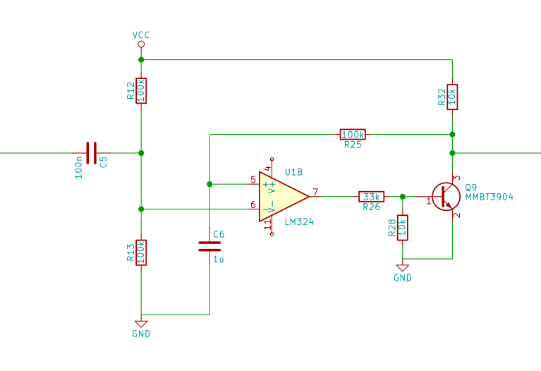
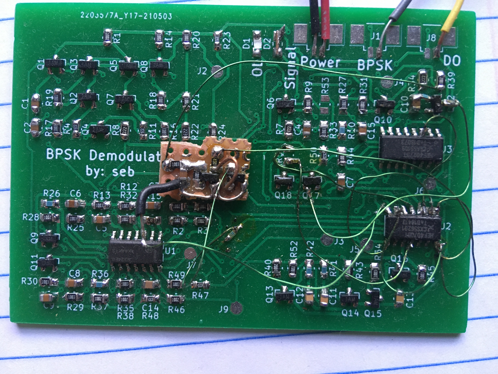
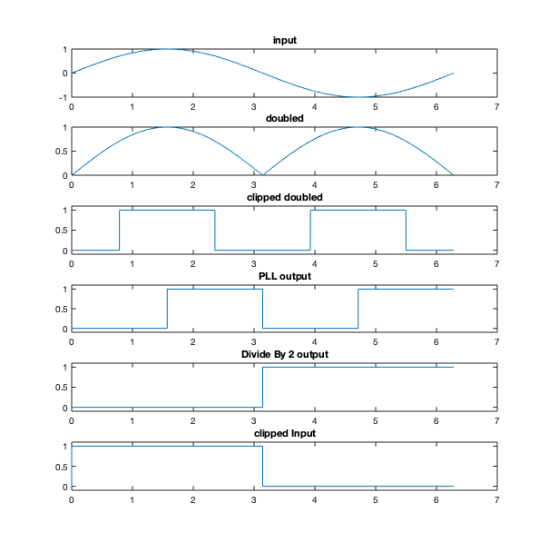

# BPSK Demodulator

## Overview

I worked on a Binary Phase Shift Keying(BPSK) Demodulator to send digital data over a telephone line. For carrier recovery, I built a multiplier using a _gilbert cell_ style design and I used a Phase Locked Loop(PLL). The PLL runs at twice the frequency of the carrier wave so the frequency must be divided by 2 to get back to the original frequency, this was done using a JK flip-flop. 1 Mixer was used in the PLL and 1 was used to get the final digital output. A _low-pass filter_ was used to handle phase mismatch in the final stage. A circuit was designed to ensure that the output always starts high. This project was done with opamps and 4000 Series CMOS.

### What does the project actually do?

## Implementation
### Squaring up signals
 * There were several points in the circuit where I wanted to take a signal like a sine-wave and turn it into a square wave with matching frequency. This was implemented with the following circuit.

 * This circuit has feedback so the duty cycle ends up very close to 50% no matter the input signal
 * However this ciruit doesn't do too well with noise as there is no hysteresis
   * This is a bit of a design trade off because hysteresis would have interfeared with the phase
     * The phase would vary with the input amplitude

### Frequency doubler
  * This was a gilber cell set up as a mixer (EXPLAIN)
  * the output is not sinusoidal. Instead it was a `full wave rectified` sine wave
    * This wasn't a problem bc of the function of the `squaring up circuit`, see above section

### PLL
  * Made of an astable multivibrator(EXPLAIN) and XOR gate for the mixer
  * Second order with very low frequency pole in the filter stage bc
    * Most important feature is to not lose lock (one cycle lost would ruin data)
    * Doesn't need to change frequency while device is operating

### Startup Detection
  * When the input signal is applied the phase must remain constant for about 10ms
  * This gives time for PLL to lock and for the start up circuity to set the phase of the divide by 2 so that the output will be high for this phase and low for opposite phase.
  * This circuity is also blanks the output while the PLL is locking up and such

## PCB
  * Due to errors I made with startup and phase I had to modify the original circuit and pcb, EXPLAIN HOW SEB FIX

## Phase
  * The phase works out quite nicely with this design
Here is a matlab plot I made to show the phase as the signal moves throught the circuit

* In order to get the phase right the divide by two has to update on the falling edge. Initially I got this wrong and I had to use a spare XOR gate as an inverter to fix the problem

## Testing
  * I needed a BPSK signal to Demodulate. Fortunately this was quite easy to generate. I just had an inverting amplifier and a noninverting ampifier with the same input and outputs added with resistors then by changing the gain of one amplifier I could flip the phase.
    * The inverting ampifier had fixed gain of 2 V/V
    * The non-Inverting had gain that could be set to 1 or 3 based on the digital input
    * The "mixing" resitors were the same value

## Function
 * With nice high bandwidth low noise signals it worked very nicely
   * Able to achive 1.6 kBits/sec
 * Struggles with noisy signals, and when bandwidth of input has been restricted
 * PLL has narrow lock range so only works with small range of carrier frequencies
   
